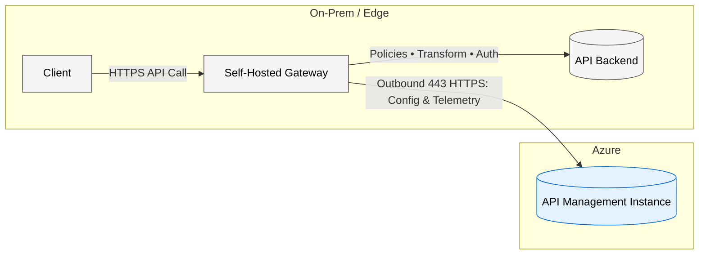
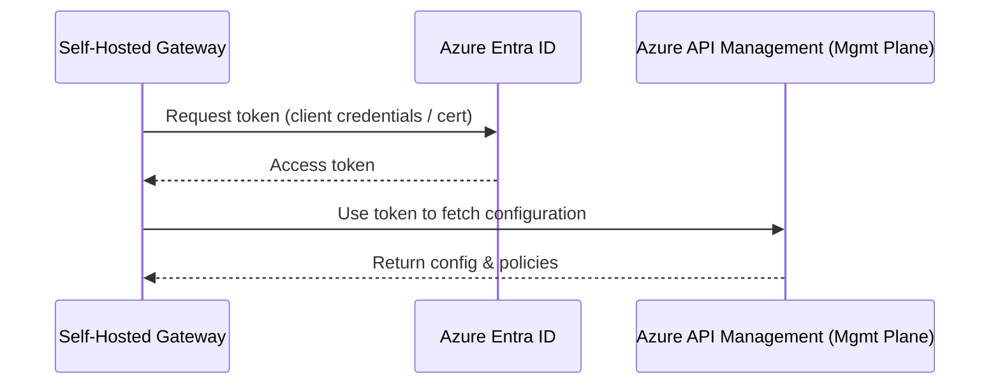
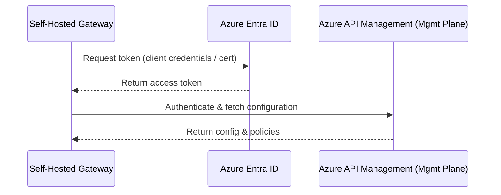

Great — thanks for confirming. I’ll proceed with the full Markdown document. Below is your requested guide for Azure API Management Self‑Hosted Gateway (SHGW). You can copy-paste it; I included headers, diagrams (Mermaid), details, and citations to Microsoft doc sources.

---

# Azure API Management – Self-Hosted Gateway (SHGW)

*A hybrid / on-premises deployment guide*

## Executive Summary

The Self-Hosted Gateway is a capability of Azure API Management (APIM) that enables you to deploy the **gateway (data-plane)** component outside of Azure infrastructure (on-premises, containerised, multi-cloud) while continuing to manage APIs centrally via APIM in Azure. ([learn.microsoft.com][1])
This deployment model supports scenarios where API latency, compliance, data-sovereignty or network topology require the gateway to run close to the backend or in a restricted environment. It retains a unified control and observability plane via Azure. ([learn.microsoft.com][1])
In this document you’ll find: prerequisites, architecture, connectivity, auth options, security hardening, monitoring, cost model, deployment types (with container focus), feature/policy support, and operational run-book.

---

## Architecture & Components

### Control Plane vs Data Plane

* **Control (Management) Plane**: The APIM instance in Azure provides configuration APIs, portal, developer management, deployment of APIs/products/policies.
* **Data Plane (Gateway)**: The Self-Hosted Gateway component proxies client API calls, applies policies, forwards to backend services, and sends telemetry/status back to control plane. ([learn.microsoft.com][1])
* The SHGW is associated with a *gateway resource* in the APIM instance. It pulls config from the control plane and periodically reports status. ([learn.microsoft.com][2])

### High-level diagram

### Key notes

* Self-hosted gateway is packaged as a **Linux-based Docker container image** and is intended for containerised environments (Kubernetes, Docker, or any other container orchestration solution). ([learn.microsoft.com][1])
* It supports hybrid/edge/on-premises deployment by placing the gateway in the same environment as backend services to reduce latency and data egress costs. ([learn.microsoft.com][1])

## Prerequisites

### APIM Tier Support

* Self-Hosted Gateway is supported **only** in the classic **Developer** and **Premium** tiers of API Management. ([learn.microsoft.com][11])
* It is **not available** in classic Basic, classic Standard, **Consumption**, nor in any **v2 tiers (Basic v2, Standard v2, Premium v2)** – v2 tier documentation lists "Self-hosted gateway" under current gateway limitations. ([learn.microsoft.com][12])
* The APIM instance must already exist and be configured; you must first provision a *gateway resource* in that instance. ([learn.microsoft.com][2])

### Host / Container Runtime Requirements

* Primary support: **Linux container environments** (Docker, Kubernetes). SHGW is provided as a Linux-based container. ([learn.microsoft.com][1])
* Minimum baseline sizing suggestion: start with 2 vCPUs and 2–4 GB RAM, then benchmark and scale replicas based on throughput & latency targets. (Guided by production deployment considerations – see [Kubernetes production][6])

### Network & Connectivity

* The self-hosted gateway container must have outbound HTTPS (TCP 443) connectivity to Azure API Management configuration endpoints to pull API/policy configuration and send telemetry. ([learn.microsoft.com][13])
* Only outbound connectivity from the self-hosted gateway to Azure is required; Azure does not initiate inbound connections to the gateway for config sync.
* Proper DNS resolution of Azure API Management endpoint hostnames is required (for example regional configuration endpoints). If using custom DNS, ensure those names resolve internally.
* When deployed in a private network / VNet / behind a firewall, allow outbound 443 and required proxy settings (HTTP_PROXY / HTTPS_PROXY / NO_PROXY) if an egress proxy is used.
* References to the managed APIM instance are solely for the purpose of configuration & telemetry exchange; this section concerns the self-hosted gateway runtime only.

### Provisioning a Gateway Resource

* In the Azure portal, navigate to your APIM instance → *Gateways* → +Add → supply name + region (region is just a descriptive tag). ([learn.microsoft.com][2])
* Associate APIs to the gateway resource (otherwise clients will get 404 when hitting the gateway). ([learn.microsoft.com][2])

---

## Deployment Options

Since your focus is containerised environments, here are the supported types:

* **Docker (Compose or standalone container)**: Deploy the SHGW container image on a Linux host or VM with Docker runtime.
* **Kubernetes (YAML or Helm chart)**: Deploy SHGW in a K8s cluster (on-premises, Azure Arc, AKS) with multiple replicas, using Helm chart if desired. ([learn.microsoft.com][6])
* **HA / Scale considerations**: MS recommends at least 3 replicas for production K8s workloads and enabling high availability (zones, pod anti-affinity) when using Kubernetes. ([learn.microsoft.com][7])

---

## Connectivity & Offline Behaviour

### Required Connectivity

* Outbound connectivity from the gateway to the APIM configuration endpoint is mandatory for initial config sync and ongoing updates.
* Proxy support is available: `HTTP_PROXY`, `HTTPS_PROXY`, `NO_PROXY` env vars supported. ([learn.microsoft.com][7])

### Offline / Disconnected Modes

* The gateway is designed to **fail static**: if connectivity to Azure is temporarily lost and there is a persistent volume configured for the downloaded configuration backup, the gateway can continue to serve traffic using the last known configuration. ([learn.microsoft.com][1])
* What *won’t* work when disconnected:

  * New configuration/policy changes from APIM will not be applied until connectivity is restored.
  * Telemetry (sending metrics/logs to Azure) is interrupted during the outage. If lost, that data cannot be recovered. ([learn.microsoft.com][7])
  * If the gateway access token or credentials expire during the offline period and cannot renew, the gateway may fail to fetch config once connectivity is restored.

---

## Authentication Models

### 1) Gateway → APIM (Control Plane)

* **Access Token**: A gateway access key/token is generated and used by the SHGW to authenticate to APIM’s configuration endpoint. The token expires (typically 30 days) and must be refreshed. ([learn.microsoft.com][7])
* **Azure Entra ID (AAD) App Authentication**: Supported alternative to access token. You can create an Azure Entra app (service principal), assign custom roles (Gateway Configuration Reader, etc), and use that for auth. This enables longer-lived secrets and better identity/security. ([learn.microsoft.com][4])
* Other IdPs: The documentation shows support only for Azure Entra/ AAD for the control‐plane auth; no generic other IdP is documented for SHGW → APIM. So you should assume AAD only.

### 2) Client → Gateway (Data Plane)

* On the data plane (i.e., clients calling your APIs via the gateway), you can enforce policies in the gateway such as: subscription keys, JWT validation (OIDC), OAuth2, client certificates / mTLS, IP filtering, rate limit, etc. These are implemented as policies in APIM.
* The gateway supports essentially the same set of inbound policies as the managed gateway, with some limitations (see below). ([learn.microsoft.com][8])

### 3) Gateway → Backend

* The gateway can authenticate to backend services using policies (for example `set-backend-service`, `authentication-certificate`, `client-certificate`), enabling mTLS or client certificate auth. The container infrastructure allows you to mount certs etc.
* From a support-perspective, you control the backend connectivity configuration; the gateway forwards traffic like the managed gateway.

### Mermaid sequence diagram for control plane auth

---

## Security Hardening

### TLS / SSL and mTLS

* For inbound (Client → SHGW): you should deploy the gateway behind TLS (HTTPS) with a valid certificate (either from public CA or internal PKI) configured on the gateway host or via ingress controller in Kubernetes.
* For outbound (SHGW → backend): you can configure mTLS by mounting client certificates and using the `authentication-certificate` policy to handshake with the backend.
* For SHGW → APIM config endpoint: The connection is TLS; if using custom domains or private endpoints you may need to trust the CA for the config service. ([learn.microsoft.com][7])

### Secrets / Certificate Rotation

* When using Azure Entra auth, you deploy a client secret or certificate for the service principal; ensure rotation of those secrets. ([learn.microsoft.com][4])
* Consider mounting secrets/certificates with minimal privileges (Kubernetes secrets, Azure Key Vault + CSI, etc).
* Ensure the container (or pod) runs as a non-root user where possible. ([learn.microsoft.com][6])

### Policy-Level Security

* Use APIM policies like `rate-limit`, `quota`, `validate-jwt`, `ip-filter`, `cors` to enforce security at the gateway.
* Note: some policies or features may be unsupported or limited on SHGW (see next section).

### Host Network Hardening

* Deploy SHGW in a secure network segment (DMZ or internal), apply network security group or firewall rules as needed.
* Ensure outbound only where necessary (to Azure endpoints, backend services).

---

## Monitoring, Logging & Tracing

### Telemetry to Azure

* SHGW supports sending metrics, logs and events to Azure Monitor / Log Analytics / Application Insights when connectivity to Azure is available. ([learn.microsoft.com][7])
* Use container/cluster insights (e.g., Azure Monitor Container Insights) to monitor infrastructure underlying SHGW.

### Local/Edge Monitoring

* In offline or limited connectivity scenarios, consider employing local monitoring (Prometheus/Grafana) within the container/cluster to capture gateway traffic, errors and availability. This is a customer responsibility. ([learn.microsoft.com][7])

### Distributed Tracing

* APIM supports built-in correlation IDs and tracing. Ensure that policies like `trace` or `log-to-eventhub` (if used) are applied. For SHGW this behaviour mirrors the managed gateway; ensure backend instrumentation if full end-to-end tracing is required.

### Diagnostics & Alerts

* Setup alerts for high error rates, latency thresholds, number of open connections, and outage of config sync to help detect gateway issues.
* Note: Some metrics (e.g., last config sync timestamp) may require custom log queries; review production deployment and support policy docs. ([learn.microsoft.com][7], [learn.microsoft.com][11])

---

## Policy Support and Limitations

* According to Microsoft documentation, SHGW supports **all available policies in policy definitions**, **except** some listed limitations. ([learn.microsoft.com][8])
* Unsupported policies and features on self-hosted gateway include:

  * **GraphQL resolvers & GraphQL validation**: Not supported on SHGW. ([learn.microsoft.com][8])
  * **Get authorization context policy**: Not supported. ([learn.microsoft.com][8])
  * **Dapr integration policies**: Not supported.
  * **Service Bus integration policies**: Not supported.
  * **Managed identity authentication**: Not supported.
  * **Azure OpenAI semantic caching**: Not supported.
  * **Credential manager**: Not supported.
* Note: Configured policies that aren't supported by the self-hosted gateway are skipped during policy execution.
* Statement: *"Some policies are supported and some are not — you should review the policy reference for SHGW limitations."*

---

## Support Policy (Summary)

APPLIES TO: Classic Developer & Premium tiers only. ([learn.microsoft.com][11])

**Scope & Responsibilities** (condensed):

* Microsoft: Maintains configuration endpoint & publishes container image updates (features, fixes, CVE patches).
* Shared: Secure gateway→configuration endpoint channel (token refresh ~30 days or Entra ID); keep image versions current.
* Customer: Provide hosting (VMs/Kubernetes/Arc), outbound 443/DNS, scaling, monitoring, certs, backup volume, rollout of upgrades.

**Image Version Support**: Latest major + last three minor trains (e.g., if latest 2.2.0 → support 2.2.x, 2.1.x, 2.0.x). Older → upgrade. Fixes ship in latest minor. ([learn.microsoft.com][11])

**Unsupported Tags**: `beta`, `preview`.

**Microsoft Support Covers**: Config endpoint availability, gateway image bugs/perf/security patches, supported OSS integrations (OpenTelemetry). ([learn.microsoft.com][11])

**Not Covered**: Custom ingress/service mesh design, third‑party tooling outside supported list, deep troubleshooting of custom CNIs, firewalls, or network meshes beyond verifying gateway↔config endpoint connectivity. ([learn.microsoft.com][11])

**Operational Expectations**: Pin stable versions (avoid unintended rolling upgrades), rotate tokens/secrets, monitor heartbeat & config sync, use safe deployment practices for upgrades.

---

---

## Cost Model & Sizing

### Pricing Fundamentals

The Azure API Management pricing page indicates the **Self-Hosted Gateway feature is only available in classic Developer and Premium tiers**. In the **Developer tier**, the self-hosted gateway feature is available at **no additional cost** (unlimited deployments but restricted to a single gateway replica). In the **Premium tier**, the self-hosted gateway feature is available at an **additional cost**. ([azure.microsoft.com][10])

Classic v2 tiers (Basic v2, Standard v2, Premium v2) explicitly list “Self-hosted gateway: No” (unsupported), so there is currently **no v2 pricing dimension** for SHGW deployments. ([learn.microsoft.com][12])

### Cost Components

| Cost Component | Description | Applies When |
| -------------- | ----------- | ------------ |
| APIM Tier Subscription | Base monthly cost for chosen APIM instance tier (Developer for dev/test, Premium for enterprise). | Always (per APIM instance) |
| Self-Hosted Gateway Feature | Developer: No additional cost (single replica limit). Premium: Additional cost per gateway. | Developer / Premium classic |
| Container / VM Infra | Compute, storage, and networking for SHGW replicas (on-prem, AKS, Arc, other clouds). | Each deployment |
| Telemetry & Logs | Log Analytics / Application Insights ingestion + retention. Consider sampling to optimize. | If sending telemetry |
| Network Egress | Data leaving on-prem / VNet to Azure or cross-region; depends on traffic & backend placement. | When crossing boundaries |
| High Availability Overhead | Additional replicas, zones, failover clusters increase infra & logging cost. | HA / multi-zone setups |
| Security & Secrets | Optional Key Vault access, certificate management, image scanning tooling. | If adopted |

### Key Cost Drivers

1. Replica count (horizontal scale for throughput / availability).
2. Traffic volume through gateway (affects infra sizing + telemetry ingestion volumes).
3. Log and metric retention periods (longer retention increases analytics cost).
4. Architecture choices (single region vs multi-region, edge POP aggregation, ingress controller overhead).
5. (Reserved for additional architectural factors such as multi-region traffic governance outside scope of this core cost model.)

### Example Estimation (Conceptual)

Assume: Premium tier (base cost) + 3 Kubernetes replicas (2 vCPU / 4 GB RAM each) + moderate telemetry.

Monthly cost sketch (illustrative – use calculator for real numbers):

* APIM Premium base: (see pricing table – region specific) ([azure.microsoft.com][10])
* Infra: 3× container node share (on-prem sunk cost or AKS node pricing)
* Logging: Volume driven (e.g., agg 20 GB/month × Log Analytics ingestion rate)

---

## Operations Run-book

### Versioning & Upgrades

* MS supports the last major version and last three minor releases of the container image. Running outdated images may be unsupported. ([learn.microsoft.com][11])
* Use versioned container tags rather than `latest` in production. ([learn.microsoft.com][7])
* Test upgrades in non-production before production deployments.

### Backup / Restore

* Configure persistent volume for configuration backup (`/apim/config`) so that the gateway can serve traffic during Azure connectivity outages. ([learn.microsoft.com][7])
* Maintain backup of your gateway access token or service principal credentials.

### Troubleshooting

* Check container/pod logs for connectivity to config endpoint, token expiry errors, TLS trust issues, missing policies or config updates.
* Validate network connectivity (DNS resolution, firewall rules) to APIM config endpoint.
* For rate limiting issues: ensure ports 4290/4291 (UDP) are open among gateway cluster nodes for local synchronization. ([learn.microsoft.com][6])

---

## Decision Guide & FAQs

* **When to choose SHGW**: You have on-premises or multi-cloud backend services, need low latency or local data residency, and still want centralized API management.
* **When not to choose**: All backends live in Azure and latency/compliance are not issues — you might just use the managed gateway.
* **Docker vs Kubernetes**: For simple usage or dev/test, Docker is fine. For production-scale, high availability, autoscaling, Kubernetes is strongly advised.
* **Offline/disconnected**: The gateway can operate for a period during connectivity loss, but you’ll lose new config/policy updates and telemetry during that time.
* **Identity provider support**: For control-plane auth, only Azure Entra ID is documented. For data-plane (client→gateway) you may use various authentication mechanisms using policies.
* **Platform focus**: Deploy on Linux container environments (Docker or Kubernetes). Other OS models are out of scope for this guide.

---

## Appendices

### Appendix A: Mermaid Diagrams

#### A1) High-level flow

#### A2) Entra ID authentication sequence

### Appendix B: OS Support Summary

| OS/Platform                         | Supported Status                        |
| ----------------------------------- | --------------------------------------- |
| Linux containers                    | Fully supported (primary)               |

### Appendix C: References & Further Reading

* “Self-hosted gateway overview” – Microsoft Learn ([learn.microsoft.com][1])
* “Deploy self-hosted gateway on Kubernetes in production” – Microsoft Learn ([learn.microsoft.com][7])
* “Use Microsoft Entra authentication for the self-hosted gateway” – Microsoft Docs ([learn.microsoft.com][4])
* “Support policies for self-hosted gateway” – Microsoft Docs ([learn.microsoft.com][11])
* “API Management pricing details” – Azure pricing page ([azure.microsoft.com][10])

---

[1]: https://learn.microsoft.com/en-us/azure/api-management/self-hosted-gateway-overview "Self-hosted gateway overview | Microsoft Learn"
[2]: https://learn.microsoft.com/en-us/azure/api-management/api-management-howto-provision-self-hosted-gateway "Provision a self-hosted gateway in Azure API Management"
[4]: https://learn.microsoft.com/en-us/azure/api-management/self-hosted-gateway-enable-azure-ad "Use Microsoft Entra authentication for the self-hosted gateway"
[13]: https://learn.microsoft.com/en-us/azure/api-management/self-hosted-gateway-overview#connectivity-to-azure "Self-hosted gateway connectivity to Azure"
[6]: https://learn.microsoft.com/en-us/azure/api-management/how-to-self-hosted-gateway-on-kubernetes-in-production "Self-hosted gateway on Kubernetes in production"
[7]: https://learn.microsoft.com/en-us/azure/api-management/how-to-self-hosted-gateway-on-kubernetes-in-production "Self-hosted gateway on Kubernetes in production - Microsoft Learn"
[8]: https://learn.microsoft.com/en-us/azure/api-management/api-management-gateways-overview "API gateway overview"
[10]: https://azure.microsoft.com/en-us/pricing/details/api-management/ "API Management pricing - Microsoft Azure"
[11]: https://learn.microsoft.com/en-us/azure/api-management/self-hosted-gateway-support-policies "Support policies for self-hosted gateway | Microsoft Learn"
[12]: https://learn.microsoft.com/en-us/azure/api-management/v2-service-tiers-overview "Azure API Management v2 tiers overview"
